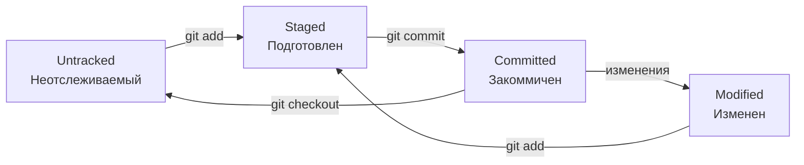
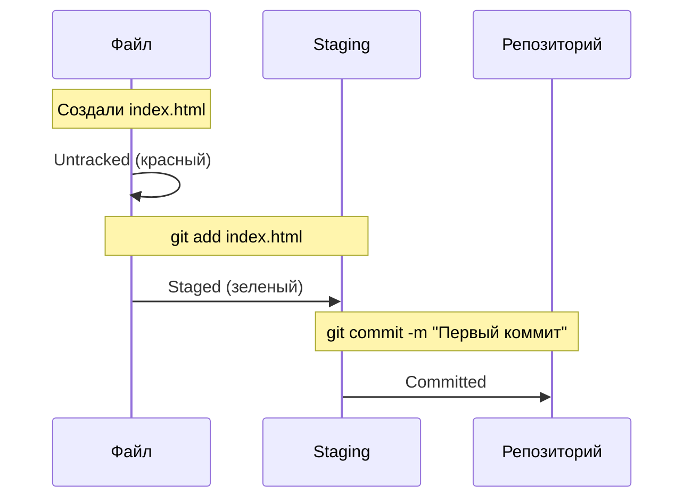

# 6️⃣ Жизненный цикл файлов и коммиты

<div align="right">
  <a href="05-first-repo.md">⬅️ Предыдущая</a> | 
  <a href="07-history.md">➡️ Следующая</a>
</div>

---

## 🔄 Жизненный цикл файла в Git

Каждый файл в Git-репозитории проходит через несколько состояний:



---

### Состояния файлов:

1. **Untracked (неотслеживаемый)** — файл новый, Git про него не знает
2. **Staged (подготовлен)** — файл добавлен в "корзину" для коммита
3. **Committed (закоммичен)** — изменения сохранены в истории
4. **Modified (изменен)** — файл изменен после последнего коммита

---

## 🎭 Staging area (Область подготовки)

**Staging area** — это промежуточная зона между рабочими файлами и репозиторием.

### Зачем она нужна?

Представьте, что вы:
- Исправили баг в одном файле
- Добавили новую функцию в другом
- Почистили код в третьем

Это **три логически разных изменения**. Staging позволяет:
1. Добавить первый файл → сделать коммит "Исправление бага"
2. Добавить второй файл → сделать коммит "Новая функция"
3. Добавить третий файл → сделать коммит "Рефакторинг"

Без staging пришлось бы все три изменения коммитить вместе.

---

## 📝 Создание коммита в JetBrains

### Шаг 1: Открыть окно коммита

**Два способа:**
- `Ctrl + K` (Windows/Linux) или `Cmd + K` (macOS)
- Кнопка ✅ на верхней панели

---

### Шаг 2: Выбрать файлы для коммита

В левой части окна:
- Поставьте галочки напротив файлов, которые хотите включить в коммит
- Цвета подсказывают статус:
  - 🟢 Зеленый — новый файл
  - 🔵 Синий — измененный файл
  - 🔴 Красный — файл будет удален
  - ⚫ Черный — без изменений (нельзя выбрать)

**Полезные кнопки:**
- **Expand All** — развернуть все папки
- **Collapse All** — свернуть все
- **Show Diff** — показать изменения (или двойной клик по файлу)

---

### Шаг 3: Написать сообщение коммита

**Хорошее сообщение коммита:**
```
Добавлена авторизация через Google

- Реализован OAuth2 клиент
- Добавлена кнопка "Войти через Google"
- Обновлена документация
```

**Плохое сообщение:**
```
исправления
```

**Правила хорошего сообщения:**
1. Первая строка — кратко (до 50 символов)
2. Пустая строка
3. Подробности (опционально)
4. Начинается с глагола (Добавлено, Исправлено, Обновлено)

---

### Шаг 4: Проверить изменения (Diff)

Кликните по файлу в списке — справа откроется Diff вьювер:
- Зеленое — добавленные строки
- Красное — удаленные строки
- Синее — измененные строки

Всегда проверяйте, что попадает в коммит!

---

### Шаг 5: Выполнить коммит

Кнопки внизу:
- **Commit** — просто сделать коммит
- **Commit and Push** — коммит + отправить на сервер
- **Amend** — исправить предыдущий коммит (заменить его)

После коммита файлы исчезают из списка изменений.

---

## 🎬 Пример: Первый коммит



---

## 📊 Что видно в интерфейсе

### После создания файла:
- Файл **красный** в Project View
- Вкладка Local Changes показывает новый файл

### После добавления в Staging (галочка):
- Файл становится **зеленым**
- Перемещается в раздел "Staged" в Local Changes

### После коммита:
- Файл становится **черным** (чистый)
- Исчезает из Local Changes
- Появляется в истории (Log)

---

## ✏️ Изменение последнего коммита (Amend)

Если забыли добавить файл или опечатались в сообщении:

1. Добавьте забытый файл в staging (галочка)
2. В окне коммита поставьте галочку **Amend**
3. Исправьте сообщение (если нужно)
4. Нажмите Commit

**Важно:** Никогда не делайте amend для коммитов, которые уже отправили (push)!

---

## 🗑️ Отмена изменений (Revert)

Если нужно отменить изменения в файле и вернуть его к состоянию последнего коммита:

1. Правый клик на файле
2. **Git → Rollback...** (или Revert)
3. Подтвердите

Или в окне Local Changes:
- Правый клик на файле → Rollback

---

## 🧩 Коммиты в терминале (для понимания)

В JetBrains не нужно, но полезно знать:

```bash
# Посмотреть статус
git status

# Добавить файл в staging
git add index.html

# Добавить все файлы
git add .

# Сделать коммит
git commit -m "Сообщение"

# Добавить и закоммитить (только для измененных файлов)
git commit -am "Сообщение"

# Посмотреть историю
git log --oneline
```

---

## 💡 Правила хороших коммитов

1. **Маленькие коммиты** — одна логическая задача = один коммит
2. **Частые коммиты** — коммитьте часто, не ждите конца дня
3. **Понятные сообщения** — представьте, что прочитаете через полгода
4. **Не коммитьте сломанный код** — каждый коммит должен работать
5. **Проверяйте Diff** — не коммитьте случайные изменения

---

## 🎯 Резюме

- ✅ Файлы проходят цикл: Untracked → Staged → Committed → Modified
- ✅ Staging нужен для группировки изменений
- ✅ `Ctrl + K` — окно коммита
- ✅ Хорошее сообщение коммита — залог понимания истории
- ✅ Проверяйте Diff перед коммитом

---

<div align="center">
  
[📚 В словарь](GLOSSARY.md) | [🏠 На главную](README.md)

</div>
