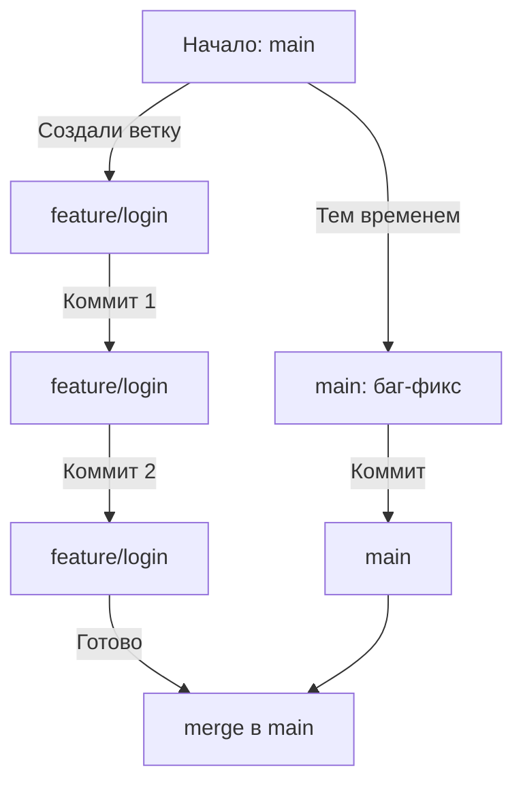

# 8️⃣ Ветвление (Branches)

<div align="right">
  <a href="07-history.md">⬅️ Предыдущая</a> | 
  <a href="09-merging.md">➡️ Следующая</a>
</div>

---

## 🌿 Что такое ветка

**Ветка (branch)** — это просто указатель на коммит.

Когда вы делаете новый коммит, указатель ветки перемещается вперед:

```
main
↓
○──○──○──○
```

Создание новой ветки — это создание нового указателя:

```
main
↓
○──○──○──○
    ↑
 feature
```

---

### Почему это гениально просто?

- Ветка — это не копия файлов
- Ветка — это не новая папка
- Ветка — это просто **имя для коммита**

Поэтому ветки в Git создаются мгновенно и ничего не весят.

---

## 🎯 Зачем нужны ветки

### 1. **Разработка новых функций**
```
main (стабильная версия)
    ○──○──○
         \
feature    ○──○──○ (новая функция, можно сломать)
```

### 2. **Исправление багов**
```
main
    ○──○──○
         \
hotfix     ○ (срочный фикс)
```

### 3. **Эксперименты**
Можно пробовать идеи, не боясь сломать основной код.

### 4. **Работа в команде**
Каждый разработчик может работать в своей ветке.

---

## 🏠 Главная ветка: main/master

- **main** (раньше master) — основная ветка
- Обычно содержит стабильную, работающую версию
- С нее начинается проект
- В нее сливают готовые функции

---

## 🌱 Создание веток в JetBrains

### Способ 1: Через меню Branches

1. Нажмите на название ветки в правом нижнем углу
2. Выберите **New Branch**
3. Введите имя (например, `feature/login`)
4. Выберите, от какого коммита создать (оставьте текущий)

---

### Способ 2: Через VCS меню

1. **VCS → Git → Branches**
2. **New Branch**
3. Введите имя

---

### Способ 3: Из окна Log

1. Правый клик на любом коммите
2. **New Branch**
3. Введите имя

---

## 🔀 Переключение между ветками

### Текущая ветка:
Всегда видна в правом нижнем углу: `Git: feature/login`

### Переключиться на другую ветку:

1. Нажмите на текущую ветку в правом нижнем углу
2. Выберите ветку из списка
3. **Checkout**

Или через VCS → Git → Branches → Choose branch → Checkout

---

### Что происходит при переключении:

1. Git меняет файлы в рабочей директории на те, что соответствуют ветке
2. HEAD начинает указывать на новую ветку
3. Все новые коммиты будут идти в эту ветку

---

## 👁️ Визуализация веток

В окне Log (`Alt + 9`) ветки отображаются цветными линиями:

```
* 8b3c5d2 (main) Добавлен README
* a1b2c3d Исправлен баг
| * 9g8h7i6 (feature/login) Добавлена форма входа
| * 7f6e5d4 Начало работы над логином
|/
* 2d4e6f8 Начальная настройка
```

- **main** — одна линия
- **feature/login** — ответвление
- Звездочка `*` — коммит
- Вертикальные линии — связи

---

## 📋 Управление ветками

### Посмотреть все ветки:
- Нажмите на текущую ветку внизу
- Или VCS → Git → Branches

### Удалить ветку:
1. VCS → Git → Branches
2. Выберите ветку
3. Delete

**Важно:** Нельзя удалить текущую ветку

### Переименовать ветку:
1. VCS → Git → Branches
2. Правый клик на ветке
3. Rename

---

## 💡 Стратегии ветвления

### 1. **Git Flow** (сложный, для больших проектов)
- `main` — только релизы
- `develop` — разработка
- `feature/*` — новые функции
- `release/*` — подготовка релиза
- `hotfix/*` — срочные исправления

### 2. **GitHub Flow** (простой)
- `main` — всегда готово к релизу
- Ветки для функций
- Обязательные Pull Requests

### 3. **GitLab Flow**
- `main`
- `pre-production`
- `production`
- Ветки с префиксами

---

## 🎯 Для начинающих достаточно:

1. **main** — стабильная версия
2. **feature/*** — новые функции
3. **bugfix/*** — исправления

---

## ⚠️ Важные понятия

### HEAD — где мы сейчас
В правом нижнем углу написано: `Git: feature/login (main)` означает:
- Сейчас мы в ветке feature/login
- Эта ветка ответвилась от main

### Upstream — связь с удаленной веткой
Локальная ветка может быть связана с удаленной:
- `main` → `origin/main`
- `feature/login` → `origin/feature/login`

---

## 🔧 Распространенные операции

### Создать ветку и сразу переключиться:
В терминале:
```bash
git checkout -b feature/login
```

В JetBrains:
- New Branch (автоматически переключит)

### Посмотреть все ветки (включая удаленные):
В окне Branches есть разделы:
- Local Branches
- Remote Branches

### Сравнить ветки:
1. Правый клик на ветке
2. Compare with Current
3. Увидите разницу в коммитах

---

## 🎭 Пример сценария



**Последовательность:**
1. Начали с main
2. Создали feature/login для новой функции
3. Сделали 2 коммита в feature
4. Кто-то исправил баг в main
5. Слили feature в main

---

## 💡 Советы по веткам

1. **Одна ветка = одна задача**
2. **Названия веток должны быть понятны**
   - ✅ `feature/user-authentication`
   - ✅ `bugfix/header-display`
   - ✅ `hotfix/critical-security`
   - ❌ `fix`
   - ❌ `new-stuff`

3. **Не сидите долго в ветке** — чем дольше, тем сложнее слияние
4. **Регулярно обновляйте main** в своей ветке
5. **Удаляйте ветки после слияния** (они захламляют список)

---

## 🎯 Резюме

- ✅ Ветка — это просто указатель на коммит
- ✅ Ветки создаются мгновенно
- ✅ main — основная, стабильная ветка
- ✅ feature/* — для новых функций
- ✅ Переключаться между ветками легко
- ✅ В Log видна вся картина веток

---

<div align="center">
  
[📚 В словарь](GLOSSARY.md) | [🏠 На главную](README.md)

</div>
