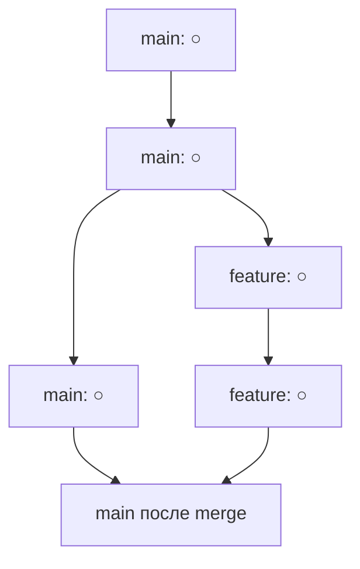

# 9️⃣ Слияние веток (Merging)

<div align="right">
  <a href="08-branches.md">⬅️ Предыдущая</a> | 
  <a href="10-remote.md">➡️ Следующая</a>
</div>

---

## 🔀 Что такое слияние

**Слияние (merge)** — это объединение изменений из разных веток в одну.

Когда вы закончили работу над новой функцией в ветке `feature/login`, нужно перенести эти изменения в основную ветку `main`.



---

## 🧠 Как работает merge

Git находит **общего предка** двух веток и применяет изменения:

```
Начало (общий предок)
    ○
   / \
main  feature
  ○    ○
   \  /
    ○
 Результат
```

---

## 🏗️ Типы слияния

### 1. **Fast-forward (перемотка)**

Если в main не было новых коммитов, Git просто передвигает указатель:

```
До:
main → ○
        \
feature → ○ → ○

После merge:
main → ○ → ○ → ○ (теперь main и feature на одном коммите)
```

### 2. **Three-way merge (трехстороннее слияние)**

Если в обеих ветках были изменения, Git создает **merge commit**:

```
     ○ ← общий предок
    / \
main ○   ○ feature
    \ /
     ○ ← merge commit
```

---

## 🤝 Слияние в JetBrains

### Простой merge (без конфликтов)

1. Переключитесь на ветку, **в которую** сливаем (обычно `main`)
2. **VCS → Git → Branches**
3. Выберите ветку, **которую** сливаем (`feature/login`)
4. Нажмите **Merge**

Или через меню в правом нижнем углу:
1. Нажмите на текущую ветку
2. Выберите ветку для слияния
3. **Merge into Current**

---

### Если merge прошел успешно:
- В Log появится новый merge commit
- Изменения из `feature` теперь в `main`
- Можно удалить ветку `feature`

---

## ⚔️ Конфликты (Conflicts)

**Конфликт** возникает, когда в двух ветках изменены одни и те же строки файла.

Git не может решить, чьи изменения правильные — нужен человек.

### Пример конфликта:

В файле `index.html`:

В ветке `main`:
```html
<h1>Добро пожаловать!</h1>
```

В ветке `feature/login`:
```html
<h1>Вход в систему</h1>
```

Git не знает, какой заголовок оставить.

---

## 🚨 Разрешение конфликтов в JetBrains

### Когда возникает конфликт:

При попытке merge JetBrains может показать окно **Resolve Conflicts**

---

### Три варианта разрешения:

1. **Accept Yours** — оставить наши изменения (из текущей ветки)
2. **Accept Theirs** — взять их изменения (из сливаемой ветки)
3. **Merge** — объединить вручную

---

### Окно ручного слияния (Merge Rebase Dialog)

Если выбрать **Merge**, откроется трехпанельное окно:

```
[Левая панель]    [Центр]           [Правая панель]
Ваша версия       Результат          Их версия
(main)            (редактируем)      (feature/login)
```

**Что делать:**
- Зеленое — добавляем
- Красное — убираем
- Синее — редактируем
- Кнопки `>>` и `<<` переносят изменения

После редактирования → **Apply** → **Commit**

---

### Альтернативный способ (внешние инструменты):

В окне конфликта можно выбрать:
- **Diff** — посмотреть различия
- **Open in external tool** — использовать внешний мердж-тул (kdiff3, beyond compare)

---

## 📝 Merge commit

После успешного слияния (даже без конфликтов) создается **merge commit**:

```
commit 8b3c5d2 (HEAD -> main)
Merge: a1b2c3d 9g8h7i6
Author: Иван Петров
Date:   10:30

    Merge branch 'feature/login'
```

У такого коммита **два родителя**:
- `a1b2c3d` — последний коммит в main до слияния
- `9g8h7i6` — последний коммит в feature

---

## 🔄 Альтернатива merge: rebase

**Rebase** (перебазирование) — другой способ объединения изменений.

Вместо создания merge commit, rebase "перекладывает" коммиты из одной ветки поверх другой.

### Merge:
```
    ○──○ main
   /    \
○──○──○──○ результат
   \    /
    ○──○ feature
```

### Rebase:
```
○──○ main
    \
     ○──○ feature (после rebase)
```

### Как сделать rebase в JetBrains:

1. Переключитесь на ветку, которую хотите перебазировать (`feature`)
2. **VCS → Git → Rebase**
3. Выберите ветку, на которую перебазируем (`main`)
4. **Rebase**

---

### Rebase vs Merge

| Merge | Rebase |
|-------|--------|
| Сохраняет полную историю | Переписывает историю |
| Понятно, когда сливали | Чистая линейная история |
| Много merge-коммитов | Нет лишних коммитов |
| Безопасно для публичных веток | Опасно для публичных веток |

**Правило:** 
- Для публичных веток (main) — merge
- Для личных веток (feature) — можно rebase

---

## 💡 Стратегии избегания конфликтов

1. **Часто обновляйте свою ветку**
   - Регулярно делайте merge из main в свою ветку
   - Или rebase на свежий main

2. **Маленькие коммиты**
   - Легче понять, что изменилось

3. **Одна задача = одна ветка**
   - Меньше пересечений

4. **Общайтесь с командой**
   - Предупреждайте, если работаете над теми же файлами

---

## 🎯 Типичные сценарии

### Сценарий 1: Завершили фичу
1. Переключиться на main
2. Pull (забрать последние изменения)
3. Merge feature в main
4. Push

### Сценарий 2: Обновить свою ветку
1. Переключиться на main, pull
2. Переключиться на свою ветку
3. Merge main в свою ветку (или rebase)
4. Продолжать работу

### Сценарий 3: Отменить merge
Если merge еще не запушен:
- Правый клик на merge commit → Reset
- Выбрать "Soft" или "Mixed"

---

## 🎯 Резюме

- ✅ Merge объединяет изменения из разных веток
- ✅ Fast-forward — если нет новых коммитов
- ✅ Merge commit — если были изменения в обеих ветках
- ✅ Конфликты — когда Git не может решить сам
- ✅ Resolve Conflicts — ручное разрешение
- ✅ Rebase — альтернатива с чистой историей

---

<div align="center">
  
[📚 В словарь](GLOSSARY.md) | [🏠 На главную](README.md)

</div>
